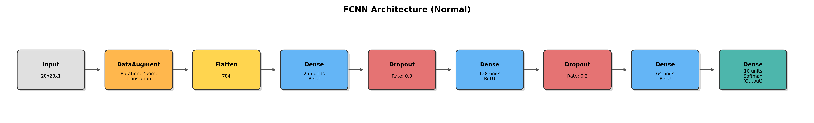
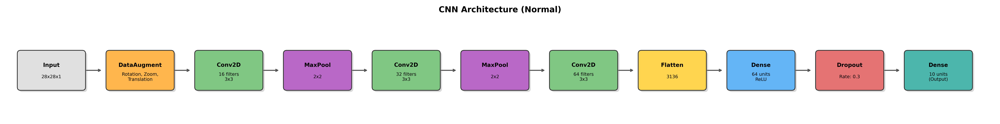
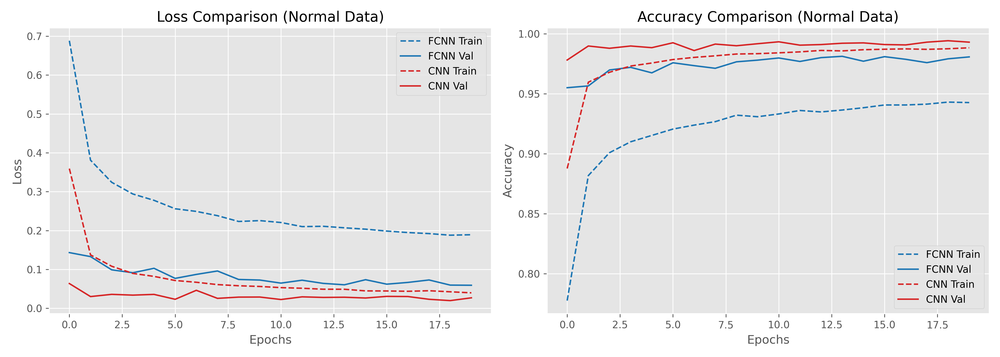
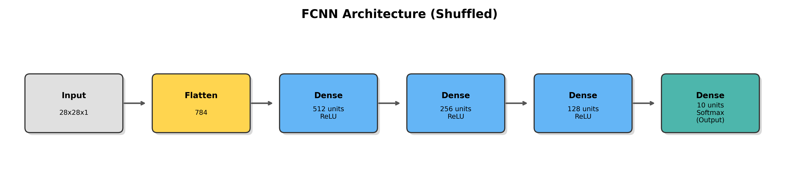
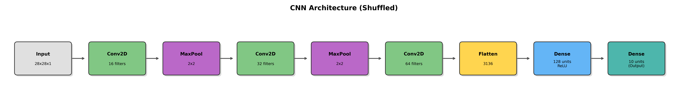
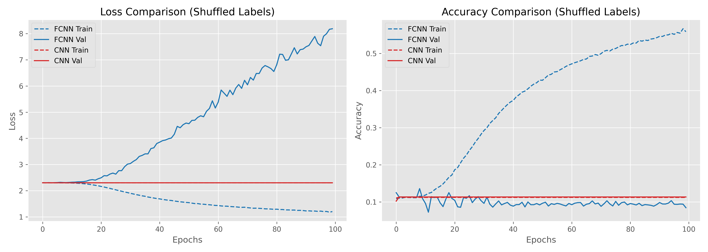

# MNIST Image Classification Report

---

## Part 1: FCNN vs CNN on MNIST Data

### Model Architectures & Parameter Sizes

Comparision of a Fully Connected Neural Network (FCNN) and a Convolutional Neural Network (CNN) on the standard MNIST dataset.

#### FCNN Architecture (Normal)

_Trainable Parameters:_ 242,762 (approx 0.95 MB)

#### CNN Architecture (Normal)

_Trainable Parameters:_ 224,714 (approx 0.88 MB)

### Results (Normal Labels)

#### Final Metrics (Epoch 20)

| Model | Training Accuracy | Training Loss | Validation Accuracy | Validation Loss |
| ----- | ----------------- | ------------- | ------------------- | --------------- |
| FCNN  | 94.27%            | 0.1893        | 98.08%              | 0.0593          |
| CNN   | 98.84%            | 0.0398        | 99.31%              | 0.0270          |

#### Observations

_Accuracy & Loss Convergence:_ The CNN converges significantly faster and achieves a higher final validation accuracy (99.31%) compared to the FCNN (98.08%). CNN also shows much lower validation loss at the end of training.

_Efficiency:_ Despite having fewer trainable parameters, the CNN utilizes spatial hierarchies of the image effectively, demonstrating exactly why Convolutional networks are the standard for vision tasks.

---

## Part 2: Model Behavior with Shuffled Labels

To analyze the memorization capability versus generalization, the labels (`y_train`) were shuffled randomly. The models were modified (parameters increased) and trained for 100 epochs.

### Adapted Model Architectures & Parameter Sizes

#### FCNN Architecture (Shuffled)

_Trainable Parameters:_ 567,434 (approx 2.16 MB)  
_Structure:_ Expanded capacity to observe memorization capability.

#### CNN Architecture (Shuffled)

_Trainable Parameters:_ 426,122 (approx 1.63 MB)  
_Structure:_ Dense layer capacity increased.

### Results (Shuffled Labels)

#### Final Metrics (Epoch 100)

| Model | Training Accuracy | Training Loss | Validation Accuracy | Validation Loss |
| ----- | ----------------- | ------------- | ------------------- | --------------- |
| FCNN  | 55.87%            | 1.2022        | 8.46%               | 8.1864          |
| CNN   | 11.24%            | 2.3013        | 11.35%              | 2.3011          |

#### Observations

_Memorization vs Generalization:_ With random labels, true generalization is impossible. The models are forced to memorize the noise, but their capacity to do so differs.

_Validation Metrics:_ As expected, validation accuracy hovers around 10% (random guessing for 10 classes). For FCNN, validation loss climbs immensely to 8.1864, confirming extreme overfitting to the training noise.

_Training Metrics:_ Over 100 epochs, the FCNN reaches 55.87% training accuracy by memorizing exact training samples. Interestingly, the CNN completely fails to overfit (training accuracy stuck at 11.24%). This highlights that CNNs have a strong inductive bias for local spatial features, making it very hard for them to memorize pure random noise compared to fully connected networks!
